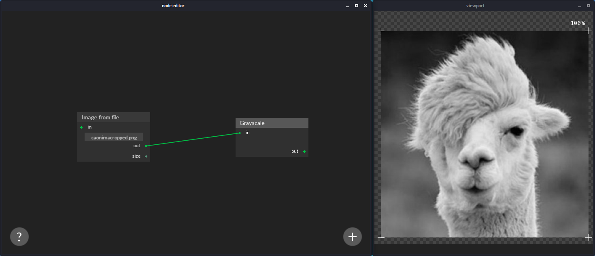

# Noose help
## Basic examples
### Convert an image to grayscale

### Replace the background of an image using color selection:

## Application usage

- Use the right mouse button to select nodes by clicking on their top bar. After selecting a node, you can visualize its outputs inside the viewport window.

- Use the left mouse button to move nodes around by dragging their top bars.

- Use the left mouse button to connect two nodes by clicking over a pin and dragging to another node's pin.

- You can save an image by right clicking the image inside the viewport window and choosing one of the context menu options.

- Use the right mouse button to delete connections by clicking and dragging over them.

- Use the middle mouse button to pan the view.

- Use the left mouse button to change node input values. Numeric values are modified by dragging across the horizontal axis.

- Use the right mouse button to enter numeric values using the keyboard. Press the enter key after introducing the value.

- Use the delete or backspace key after selecting a node to delete it.

- Use the spacebar to find nodes by typing their names.
